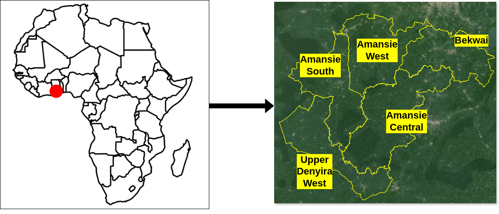
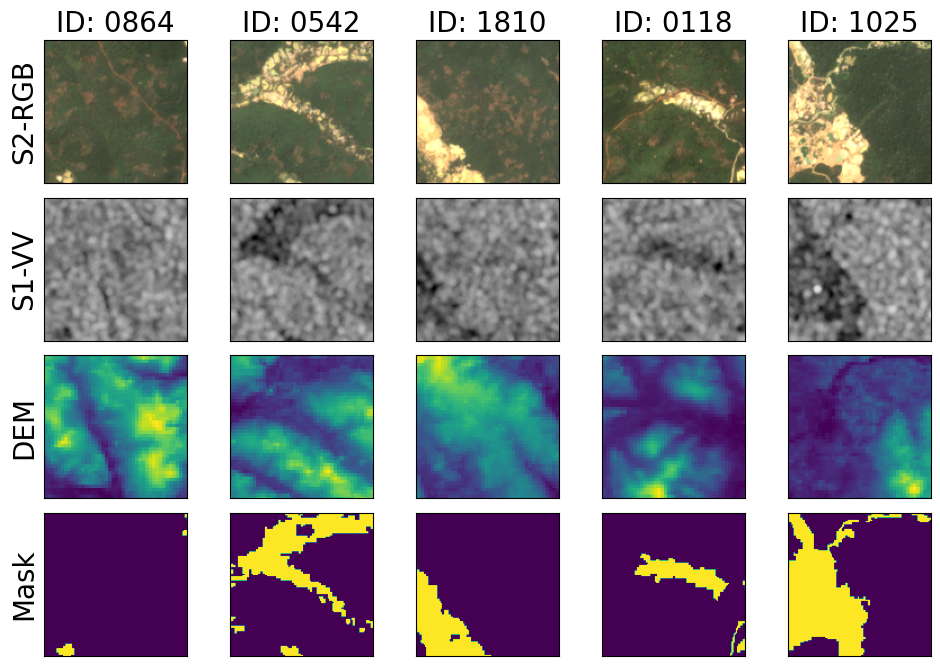
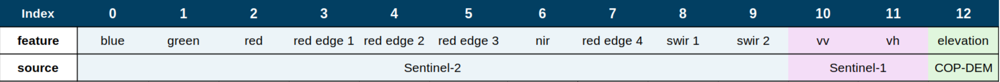

<div align="center">
<h1>SmallMinesDS </h1>
<h3>A Multi-Modal Dataset for Mapping Artisanal and Small-Scale Gold Mines</h3>

[Stella Ofori-Ampofo]<sup>1</sup>, [Antony Zappacosta]<sup>2</sup>, [Ridvan Salih Kuzu]<sup>2</sup>, [Peter Schauer]<sup>3</sup>, [Martin Willberg]<sup>3</sup>, [Xiao Xiang Zhu]<sup>1,4</sup>, 

<sup>1</sup> Technical University of Munich, <sup>2</sup> German Aerospace Center (DLR), <sup>3</sup> Industrieanlagen-Betriebsgesellschaft mbH (IABG), <sup>4</sup> Munich Center for Machine Learning

Paper: [Journal](https://sample) (DOI: XXXXXX-XXXXXXX)
</div>


## Updates
``Jan. 10, 2025`` The first version of SmallMinesDS is available on [HuggingFace](https://huggingface.co/datasets/ellaampy/SmallMinesDS)


### Introduction
The gradual expansion of unregularized artisanal small-scale gold mining (ASGM) fuels environmental degradation and poses a risk to miners and mining communities. To enforce sustainable mining, support reclamation initiatives, and pave the way for understudying the impacts of mining, we present SmallMinesDS, a benchmark dataset for mapping artisanal small-scale gold mining from multi-sensor satellite images. The initial version of the dataset covers five districts in Southwestern Ghana in two time periods. 
The first version of SmallMinesDS covers five administrative districts in Southwestern Ghana with a ground area of about 3200 sq.km. 
SmallMinesDS includes satellite images from optical and radar sensors in the dry season (January) for two years (2016 and 2022). 
The area covered is ecologically diverse, hosting rich biodiversity and serving as a hub for multiple land-use activities, 
including crop cultivation, forestry, industrial and small-scale gold mining. 
This multifaceted landscape underscores the importance of reliable mapping and monitoring of ASGM activities.




### Data description
- SmallMinesDS contain ```4270``` patches; ```2175``` each for 2016 and 2022

- Each patch has an input shape of ```13 x 128 x 128``` and a corresponding mask of ```1 x 128 x 128```
  
- The open-access data can be downloaded at [Hugging Face](https://huggingface.co/datasets/ellaampy/SmallMinesDS)





### Quick start

#### Prerequisites
- **Conda** (for managing environments)
- **NVIDIA GPU** (for efficient computation)

#### Setting Up Environments
Two separate virtual environments are required:
1. **Terratorch Environment** (for TerraTorch dependencies)
2. **SAM2 Environment** (for Segment Anything Model v2 dependencies)

These environments are necessary as they rely on different PyTorch versions.

#### Creating the TerraTorch Environment
```bash
conda create -n terratorch python=3.11
conda activate terratorch
pip install -r requirements.txt
conda deactivate
```

#### Creating the SAM2 Environment
```bash
conda create -n sam2 python=3.11
conda activate sam2
chmod +x install_sam2.sh
bash install_sam2.sh
mv scripts/ft-sam2.py sam2/
conda deactivate
```

#### Fine-tuning Prithvi-2
Fine-tune Prithvi-2 using our dataset.

#### Fine-tuning with the 300M Model
```bash
conda activate terratorch
python scripts/train-prithvi-v2-300.py
```

#### Fine-tuning with the 600M Model
```bash
conda activate terratorch
python scripts/train-prithvi-v2-600.py
```

#### Training ResNet50 from Scratch
To compare with Prithvi-2, we train ResNet50 from scratch using six spectral bands: **Blue, Green, Red, Narrow NIR, SWIR, and SWIR 2**.

```bash
conda activate terratorch
python scripts/train-resnet50-6bands.py
```

#### Fine-tuning the Segment Anything Model v2 (SAM2)
Segment Anything Model v2 is a foundational model designed for promptable visual segmentation in RGB images and videos. We fine-tune it using the RGB channels of our dataset.

```bash
conda activate sam2
python sam2/ft-sam2.py
```

## Fine-tuning ResNet50 Pretrained on ImageNet
For a fair comparison in the RGB domain, we fine-tune a ResNet50 model pretrained on ImageNet and compare its performance with SAM2.

```bash
conda activate terratorch
python scripts/ft-resnet50.py
```

### Citation
If you use the dataset or supporting code in your research, please cite `SmallMinesDS` as :

```
@article{sample-preprint,
    author          = {},
    month           = xxxx,
    title           = {{SmallMinesDS: A Multi-Modal Dataset for Mapping Artisanal and Small-Scale Gold Mines}},
    journal         = {Preprint Available on arxiv:xxxxxx},
    year            = {2025}
}

```